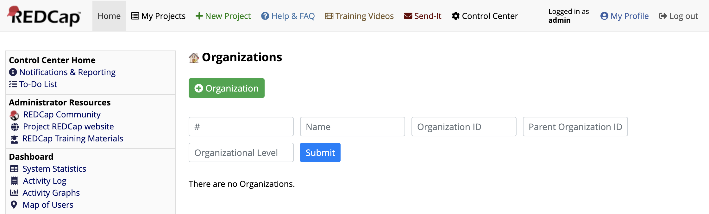
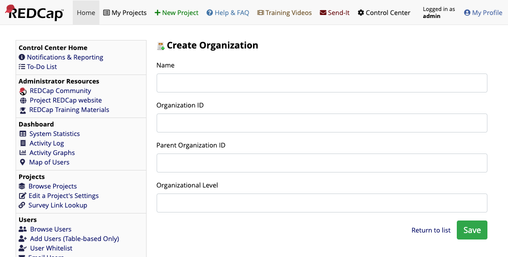
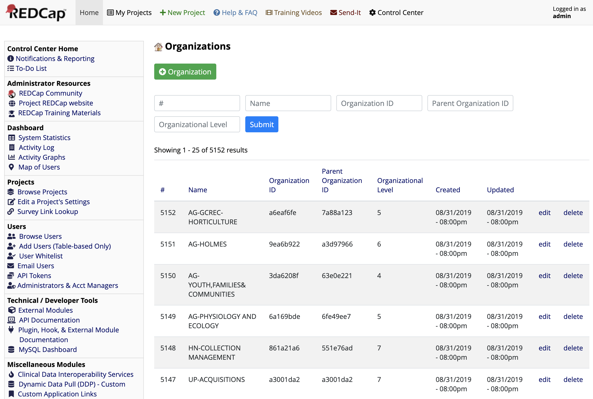

# Organizations REDCap Module

The module is a demonstration of REDCap Entity, a library the simplifies REDCap module development by managing novel data types. This module creates an organization data type.


## Prerequisites
- REDCap >= 8.7.0
- redcap_entity >= 2.2.0

- Install and configure [REDCap Entity](https://github.com/ctsit/redcap_entity) according to its instructions.
- Clone this repo into to `<redcap-root>/modules/organizations_<version_number>`.
- Go to **Control Center > Manage External Modules** and enable _Organizations_.


## Using this project

This module exists to show the code required to manage a data type with REDCap Entity. When enabled, it automatically creates the MySQL table `redcap_entity_organizations` and adds a link labeled "Organizations" in the _Control Center_. When clicked, that link shows this interface



If you click the "+ Organization" button you can manually enter new organization data. It enforces the rule that the level must be a number, but otherwise this particular form has no rules.



If you enter some new organizational records, the "Organizations" interface will look something like this:



You can use the interface presented by REDCap Entity to filter and sort the data. The pager allows you to move through very large datasets. If you load the sample dataset, you can see the performance is still very good even with a 5000-record dataset.

### Sample dataset

This repository includes a sample dataset of university organizations at [`sample_data/redcap_organizations_data.csv`](sample_data/redcap_organizations_data.csv)

This CSV matches the structure of the table REDCap Entity creates for this project. Use your favorite MySQL client to import the data into the table `redcap_entity_organizations`. 

At CTS-IT, we load the data via the MySQL client of our test VMs like this:

```
echo "load data local infile 'sample_data/redcap_organizations_data.csv' into table redcap_entity_org FIELDS TERMINATED BY ',' OPTIONALLY ENCLOSED BY '\"' IGNORE 1 ROWS" | mysql
```
